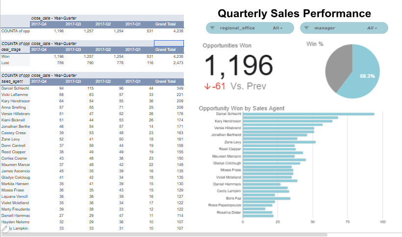

https://docs.google.com/spreadsheets/d/13zUczf5hi0HPkyqxS0jN8CkjVtDIoVoyDhTXNX_dzOs/edit?usp=sharing
# CRM-sales-dashboard
This dashboard provides a comprehensive view of sales team performance using CRM opportunity data. It tracks won/lost deals, quarterly trends, agent-level contributions, and win rate metrics — all built directly in Google Sheets with pivot tables and native charts.

## 🗂️ Dashboard Components

### 1. 📋 Pivot Table — Opportunities by Quarter
| Column | Description |
|---|---|
| `close_date - Year-Quarter` | Groups opportunities by fiscal quarter |
| `COUNTA of opp` | Total number of opportunities per quarter |
| `2017-Q1` through `2017-Q4` | Individual quarter columns |
| `Grand Total` | Sum across all quarters |

**Key Figures:**
- Total Opportunities Tracked: **4,238**
- Q4 2017 (most recent): **1,196 opps**
- Q1 2017 (earliest): **531 opps**

---

### 2. 🎯 Win / Loss Breakdown by Deal Stage
| Stage | Q4 | Q3 | Q2 | Q1 | Total |
|---|---|---|---|---|---|
| **Won** | 1,196 | 1,257 | 1,254 | 531 | **4,238** |
| **Lost** | 789 | 790 | 778 | 116 | **2,473** |

**Insight:** Win volume has grown steadily from Q1 to Q3, with Q4 showing a slight dip — likely mid-cycle. Lost deal volume closely tracks won volume, indicating consistent pipeline activity.

---

### 3. 👤 Sales Agent Performance Table
Ranked by total opportunities closed (Won + Lost):

| Rank | Agent | Q4 | Q3 | Q2 | Q1 | Total |
|---|---|---|---|---|---|---|
| 1 | Darcel Schlecht | 94 | 115 | 96 | 44 | **349** |
| 2 | Vicki Laflamme | 68 | 63 | 57 | 33 | **221** |
| 3 | Kary Hendrixson | 64 | 54 | 55 | 36 | **209** |
| 4 | Anna Snelling | 57 | 55 | 71 | 25 | **208** |
| 5 | Versie Hillebrand | 51 | 47 | 52 | 26 | **176** |
| 6 | Kami Bicknell | 51 | 44 | 53 | 26 | **174** |
| 7 | Jonathan Berthe | 46 | 54 | 57 | 14 | **171** |
| 8 | Cassey Cress | 39 | 53 | 48 | 23 | **163** |
| 9 | Zane Levy | 52 | 41 | 50 | 18 | **161** |
| 10 | Donn Cantrell | 37 | 58 | 44 | 19 | **158** |

> Full agent list includes 20+ representatives. Lowest tracked total: **107 opps** (Hayden Neloms, Cacy Lampkin).

---

### 4. 📈 KPI Cards (Right Panel)
| Metric | Value |
|---|---|
| **Opportunities Won (Current Period)** | 1,196 |
| **Change vs. Previous Period** | 🔴 -61 |
| **Win Rate** | 60.3% |

---

### 5. 📊 Bar Chart — Opportunities Won by Sales Agent
Horizontal bar chart ranking agents by won deals in the current period. Top performers:
- **Darcel Schlecht** — highest bar (≈ 95+ wins)
- **Kary Hendrixson**, **Versie Hillebrand** — close second tier
- Majority of agents cluster between **25–75** wins

---

## 🔧 Data Structure

```
CRM Export (Google Sheets)
├── Raw Data Tab
│   ├── opp_id
│   ├── close_date
│   ├── deal_stage (Won / Lost)
│   ├── sales_agent
│   └── regional_office
│
└── Dashboard Tab
    ├── Pivot Table 1 — Opps by Quarter
    ├── Pivot Table 2 — Won/Lost by Quarter
    ├── Pivot Table 3 — Agent Performance
    ├── KPI Cards (Won count, Δ vs Prev, Win%)
    └── Bar Chart — Won by Agent
```

---

## 📐 Filters Available

| Filter | Options |
|---|---|
| `regional_office` | All / by region |
| `manager` | All / by manager |

Both filters are accessible via dropdown slicers at the top right of the dashboard.

---

## 🚀 How to Use

1. **Clone or download** this repository
2. Open `crm-dashboard.xlsx` (or the linked Google Sheet) in Google Sheets or Excel
3. Navigate to the **Dashboard** tab
4. Use the **regional_office** and **manager** dropdowns to filter the view
5. Pivot tables and charts update automatically

---

## 📁 File Structure

```
📦 crm-sales-dashboard/
 ┣ 📊 crm-dashboard.xlsx       ← Main dashboard file
 ┣ 📄 README.md                ← This file
 ┣ 📂 data/
 ┃ ┗ 📄 raw_crm_export.csv     ← Source data
 ┗ 📂 docs/
   ┗ 📄 analysis-report.md     ← Full analysis report
```

---

## 📊 Tech Stack

- **Platform:** Google Sheets / Microsoft Excel
- **Visualization:** Native Google Sheets Charts
- **Data Source:** CRM Export (Salesforce / HubSpot compatible)
- **Analysis:** Pivot Tables, KPI Cards, Horizontal Bar Chart
